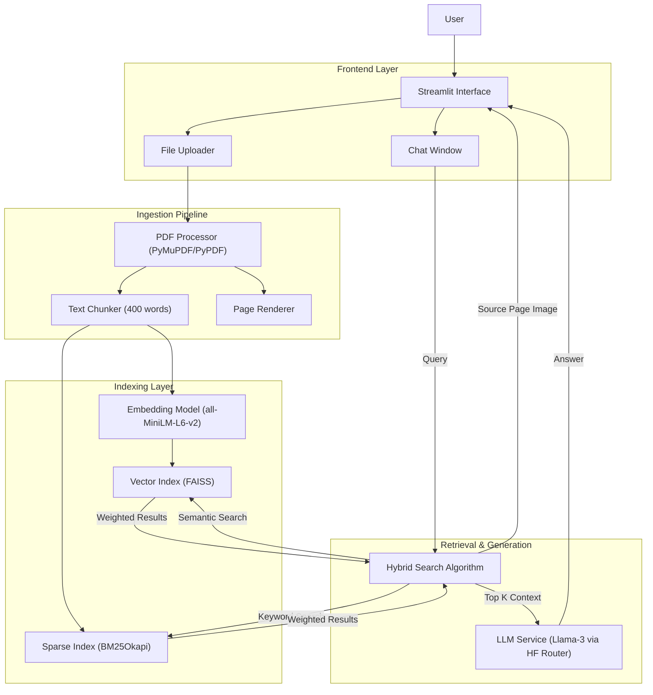

Live Demo: https://huggingface.co/spaces/RathnavelRahul/omni

# Omni RAG: Multimodal Retrieval System


> **A state-of-the-art RAG architecture combining Hybrid Search (Dense + Sparse), Multimodal Context Retrieval, and Llama-3 reasoning.**

[](https://www.python.org/)
[](https://streamlit.io/)
[](https://huggingface.co/)

---

##  Table of Contents

- [Overview](#-overview)
- [Key Features](#-key-features)
- [System Architecture](#-system-architecture)
- [Tech Stack](#-tech-stack)
- [Project Structure](#-project-structure)
- [Getting Started](#-getting-started)
- [Usage Guide](#-usage-guide)
- [Roadmap](#-roadmap)
- [Contributing](#-contributing)
- [License](#-license)

---

##  Overview

### The Problem
Traditional Retrieval-Augmented Generation (RAG) systems often suffer from "context blindness." They retrieve text chunks but lose the visual context (charts, diagrams, layouts) crucial for understanding complex documents like PDFs. Furthermore, relying solely on semantic search (embeddings) can miss exact keyword matches, while keyword search misses semantic meaning.

### The Solution
**Omni RAG** is a sophisticated document interaction system that solves these issues through a **Hybrid Search Architecture**. It combines the precision of **BM25** (keyword matching) with the semantic understanding of **FAISS** (vector embeddings). Uniquely, it preserves the **visual context** by retrieving and displaying the exact PDF page image alongside the textual answer generated by **Meta Llama 3**.

---

##  Key Features

*   ** Hybrid Search Engine**: Implements a weighted ensemble retriever (0.6 Dense Vector + 0.4 Sparse Keyword) using FAISS and Rank-BM25 for superior retrieval accuracy.
*   ** Multimodal Context**: Automatically renders and displays the specific page of the PDF source document corresponding to the retrieved text chunk.
*   ** Llama-3 Integration**: Leverages the reasoning power of `Meta-Llama-3-8B-Instruct` via the Hugging Face Inference Router.
*   ** Multi-Format Ingestion**: Supports PDF, TXT, and MD files with intelligent chunking strategies.
*   ** Real-time Processing**: In-memory indexing and retrieval for low-latency interactions.
*   ** Interactive UI**: A clean, chat-based interface built with Streamlit.

---

##  System Architecture

The system follows a **Micro-Monolithic** design pattern, encapsulating ingestion, indexing, and retrieval logic within modular utilities, served via a reactive Streamlit frontend.



---

##  Tech Stack

| Component | Technology | Description |
| :--- | :--- | :--- |
| **Frontend** | Streamlit | Reactive web framework for data apps. |
| **LLM** | Meta Llama 3 | 8B Parameter Instruct model via Hugging Face Router. |
| **Embeddings** | SentenceTransformers | `all-MiniLM-L6-v2` for dense vector generation. |
| **Vector DB** | FAISS (CPU) | Efficient similarity search for dense vectors. |
| **Sparse Search** | Rank-BM25 | Probabilistic information retrieval algorithm. |
| **PDF Engine** | PyMuPDF (Fitz) & PyPDF | High-performance PDF text extraction and image rendering. |
| **Orchestration** | Python 3.10+ | Core application logic. |

---

##  Project Structure

```bash
Multimodel-Rag-/
├── app.py               # Application Entry Point (Streamlit UI)
├── utils.py             # Core Logic (ETL, Indexing, Search, LLM)
├── requirements.txt     # Dependency definitions
├── README.md            # Documentation
└── __pycache__/         # Compiled Python bytecode
```

---

##  Getting Started

### Prerequisites
- Python 3.10 or higher
- A [Hugging Face Account](https://huggingface.co/) (for the API Token)

### Installation

1.  **Clone the repository**
    ```bash
    git clone https://github.com/rahulratho15/Multimodel-Rag-.git
    cd Multimodel-Rag-
    ```

2.  **Create a Virtual Environment**
    ```bash
    python -m venv venv
    source venv/bin/activate  # On Windows: venv\Scripts\activate
    ```

3.  **Install Dependencies**
    ```bash
    pip install -r requirements.txt
    ```

### Configuration

The application requires a Hugging Face Token to access the Llama-3 model.

1.  Obtain a token from [Hugging Face Settings](https://huggingface.co/settings/tokens).
2.  Set the environment variable:

    **Linux/Mac:**
    ```bash
    export HF_TOKEN="your_hf_token_here"
    ```

    **Windows (PowerShell):**
    ```powershell
    $env:HF_TOKEN="your_hf_token_here"
    ```

---

##  Usage Guide

1.  **Launch the Application**
    ```bash
    streamlit run app.py
    ```

2.  **Upload Documents**
    - Navigate to the sidebar (or top column on mobile).
    - Upload one or more PDF/TXT files.
    - Click **"Process Files"**. Wait for the success message indicating chunks have been indexed.

3.  **Ask Questions**
    - Type your query in the chat input (e.g., *"What is the revenue growth in Q3?"*).
    - The system will return:
        - A text answer generated by Llama-3.
        - Citations (Source file + Page number).
        - **Visual Evidence**: An image of the specific page from the PDF where the answer was found.

---

##  Roadmap

- [ ] **OCR Integration**: Add Tesseract support for scanned (non-selectable) PDFs.
- [ ] **Local LLM Support**: Add support for Ollama to run models entirely offline.
- [ ] **Advanced Reranking**: Implement a Cross-Encoder reranker for higher precision.
- [ ] **Persistent Database**: Migrate from in-memory FAISS to ChromaDB or Qdrant for data persistence.

---


